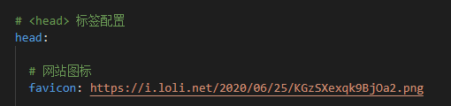
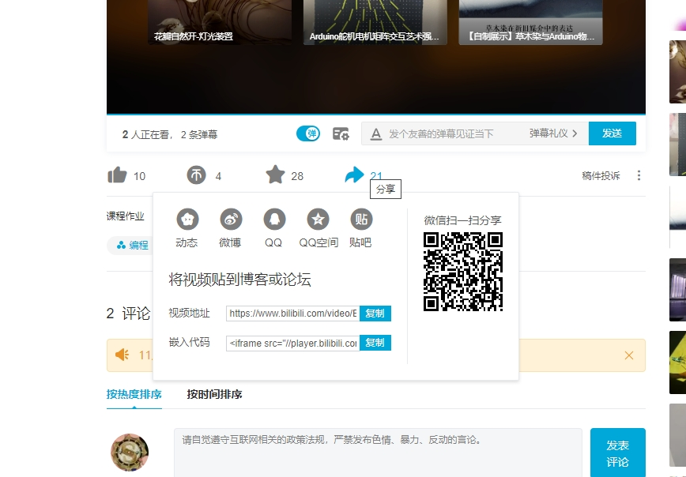

网站配置
博客插入图片视频音频链接
（近段时间寻找的博客教程合集及自己的实践方法）
---
<!--more-->
可在右侧导航栏导航


# 一、网站

仅针对此网站主题：cards，不知道其他主题是不是相同设置。
cards主题demo页：<https://theme-cards.ichr.me/demo/>
cards主题官方配置教程：<https://theme-cards.ichr.me/config/>


左：favicon图标  右：title
## 1.1.favicon更换

记住！图标最好是16*16像素。
### 网页图片方法

cards官方配置教程：<https://theme-cards.ichr.me/config/>
我用的方法：将图片上传到sm.ms，复制链接（格式如下的），粘贴至主题项目目录`_config.yml`文件 `head` 中的 `favicon` 后面

``` bash
favicon: 图片链接
例：favicon: https://i.loli.net/2020/06/25/KGzSXexqk9BjOa2.png
```


### 本地图片

需要将图片放置到 `source` 文件夹（即md文件所在的上级文件夹）。`favicon` 后面输入下方内容
  
``` bash
favicon: /图片名.png
例子： favicon: /icon.png
```

## 1.2.title更换

在根目录`_config.yml`中，`Site`后修改`title`后的名称。

``` bash
 # Site
title: hexo
例：title: ok
```
## 1.3.增加页面page

cards主题有自带的几个page相关设置，例如: 标签`tags` 分类`categories` 友链`links`
cards主题官方教程：<https://theme-cards.ichr.me/pages/>
若是需要自定义的增加page，可以参考下方教程，但页面只能与文章页相同排布
网络教程：<https://www.cnblogs.com/hankleo/p/11606224.html>
我额外加入了`about me`的page，流程如下

（1）
终端输入如下命令
``` bash
hexo new page "about me"
```
根目录`source`文件夹内自动新建子文件夹`about me`
其中文件`index.md`里可以编写文章，为`about me`添加内容
文章名字可以在此更改
``` bash
---
title: About me  #可修改，网页显示此名，默认文件夹名，但不受文件夹名影响
date: 2020-06-27 01:12:19
---
```
（2）
cards主题项目目录里`_config.yml`文件`cover`中的`menu`后添加如下代码

``` bash
# 封面 cover 设置
cover: 
  # cover 按钮菜单，通常用于站内导航
  menu: 
    - name: 关于我 #首页链接显示的是此名称，不受文章名字影响
      url: /about me/ #输入文件路径
```
（3）
`hexo s` 预览可以看到首页界面多出了一个链接按钮，

# 二、博客内容书写语法

1.超链接    2.图片    3.视频（音频）

## 2.1.超链接
``` bash
方法一：
[链接文字](链接地址 "链接描述")
[示例链接](https://www.example.com/ "示例链接")
例：[钱塘印象交互装置](https://www.bilibili.com/video/BV1tJ411q7df "钱塘印象交互装置视频链接")
```
[钱塘印象交互装置](https://www.bilibili.com/video/BV1tJ411q7df "钱塘印象交互装置视频链接")


``` bash
方法二：
<链接地址>
<https://www.example.com/>
例：<https://www.bilibili.com/video/BV1tJ411q7df>
```
<https://www.bilibili.com/video/BV1tJ411q7df>


## 2.2.插入图片（下级标题里是插入本地图片的一种参考方法）

``` bash

#鼠标移到图片上会出现图片详情“图片描述”
```

网络图片插入格式（在之前的《我的第一篇博客》里有这段代码）：
``` bash


例：
```


本地图片插入方法
hexo官网教程方法：<https://hexo.io/zh-cn/docs/asset-folders>
貌似不需要再安装插件，但我是失败了，可以先试试这个方法。


以下是我的可参考方法。

### 需要安装的插件
网络参考教程：<https://www.cnblogs.com/codehome/p/8428738.html>

先提前在根目录`_config.yml`里设置，将false修改为true，
此后新建文章都会新建配套同名文件夹，图片可以拖入文件夹用以后续引用。
（我的情况：后来也将图片放在别的文件夹进行引用，都无法加载，必须在同名文件夹内）
``` bash
post_asset_folder: true
```

网络教程提供插件有两个版本，不确定哪一个可以实现，二者貌似版本不同，我最后安装的是第二个。

``` bash
npm install hexo-asset-image --save
```
``` bash
npm install https://github.com/CodeFalling/hexo-asset-image --save
```

### blog引用本地图片的语法
（我的情况是这样）
图片必须事先放入博客同名文件夹内，才能引用。

``` bash


#文件所在文件夹可以不用添加，可直接输入图片名。
例：
```


第二行这种写法可以修改图片大小尺寸
``` bash

例：
例：
```


## 2.3.插入视频
网络参考教程：<https://www.jianshu.com/p/3525536f9dcd>
包含三种视频插入方式，以及音频插入方法

（以下以bilibili为例）
复制分享链接里的“嵌入代码”直接粘贴到blog正文中。





``` bash
例：<iframe src="//player.bilibili.com/player.html?aid=77906634&bvid=BV1tJ411q7df&cid=133286142&page=1" scrolling="no" border="0" frameborder="no" framespacing="0" allowfullscreen="true"> </iframe>
```

<iframe src="//player.bilibili.com/player.html?aid=77906634&bvid=BV1tJ411q7df&cid=133286142&page=1" scrolling="no" border="0" frameborder="no" framespacing="0" allowfullscreen="true"> </iframe>


修改视频大小，增加以下代码

``` bash
width="800px" height="600px"
```

``` bash
例：<iframe src="//player.bilibili.com/player.html?aid=77906634&bvid=BV1tJ411q7df&cid=133286142&page=1" scrolling="no"  width="600px" height="450px"  border="0" frameborder="no" framespacing="0" allowfullscreen="true"> </iframe>
#由于主题限制，我必须再缩小视频大小：600 * 450 px
```


<iframe src="//player.bilibili.com/player.html?aid=77906634&bvid=BV1tJ411q7df&cid=133286142&page=1" scrolling="no"  width="600px" height="450px" border="0" frameborder="no" framespacing="0" allowfullscreen="true"> </iframe>